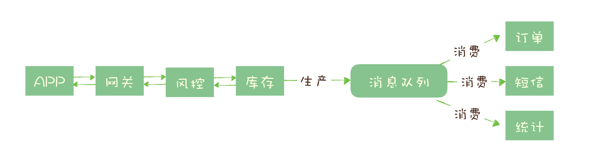

本文档根据极客时间消息队列高手课整理。为方便查询，先放上几个开源消息队列的官方文档：

- RabbitMQ 官方文档： https://www.rabbitmq.com/documentation.html

- RocketMQ 官方文档： https://rocketmq.apache.org/docs/quick-start/

  RocketMQ 中国开发者中心：http://rocketmq.cloud/zh-cn/

- Kafka 官方文档： http://kafka.apache.org/documentation/


# 消息队列解决的问题

## 服务解偶

上游系统将消息放入消息队列中，下游系统通过订阅消息队列，可以避免上游系统为下游系统频繁修改接口，降低系统间耦合性。

例如在电商系统中的订单服务，当创建一个订单时：

- 支付系统需要发起支付流程；
- 风控系统需要审核订单的合法性；
- 客服系统需要给用户发短信告知用户；
- 经营分析系统需要更新统计数据；

这些订单下游的系统都需要实时获得订单数据。随着业务不断发展，这些订单下游系统不断的增加、变化，并且每个系统可能只需要订单数据的一个子集，负责订单服务的开发团队不得不花费很大的精力，应对不断增加变化的下游系统，不停地修改调试订单系统与这些下游系统的接口。任何一个下游系统接口变更，都需要订单模块重新进行一次上线，对于一个电商的核心服务来说，这几乎是不可接受的。

所有的电商都选择用消息队列来解决类似的系统耦合过于紧密的问题。引入消息队列后，订单服务在订单变化时发送一条消息到消息队列的一个主题 Order 中，所有下游系统都订阅主题 Order，这样每个下游系统都可以获得一份实时完整的订单数据。

无论增加、减少下游系统或是下游系统需求如何变化，订单服务都无需做任何更改，实现了订单服务与下游服务的解耦。


## 异步处理

在某些写入操作时，利用消息队列可以将不必要串形化的地方实现并行化，提升系统性能，缩短响应时间。

例如秒杀系统需要解决的核心问题是，如何利用有限的服务器资源，尽可能多地处理短时间内的海量请求。我们知道，处理一个秒杀请求包含了很多步骤，例如：

* 风险控制； 
* 库存锁定； 
* 生成订单； 
* 短信通知； 
* 更新统计数据

如果没有任何优化，正常的处理流程是：App 将请求发送给网关，依次调用上述 5 个流程，然后将结果返回给 APP。对于对于这 5 个步骤来说，能否决定秒杀成功，实际上只有风险控制和库存锁定这 2 个步骤。只要用户的秒杀请求通过风险控制，并在服务端完成库存锁定，就可以给用户返回秒杀结果了，对于后续的生成订单、短信通知和更新统计数据等步骤，并不一定要在秒杀请求中处理完成。

所以当服务端完成前面 2 个步骤，确定本次请求的秒杀结果后，就可以马上给用户返回响应，然后把请求的数据放入消息队列中，由消息队列异步地进行后续的操作。




## 流量控制—削峰

为了避免大量请求冲击后台服务，可以使用消息队列暂存请求，保证后台安全性；或使用令牌桶，预估后台系统的处理能力，只有获取到令牌才可以调用后台服务。

一个设计健壮的程序有自我保护的能力，也就是说，它应该可以在海量的请求下，还能在自身能力范围内尽可能多地处理请求，拒绝处理不了的请求并且保证自身运行正常。不幸的是，现实中很多程序并没有那么“健壮”，而直接拒绝请求返回错误对于用户来说也是不怎么好的体验。

我们的设计思路是，使用消息队列隔离网关和后端服务，以达到流量控制和保护后端服务的目的。

加入消息队列后，整个秒杀流程变为：

1. 网关在收到请求后，将请求放入请求消息队列；
2. 后端服务从请求消息队列中获取 APP 请求，完成后续秒杀处理过程，然后返回结果。


秒杀开始后，当短时间内大量的秒杀请求到达网关时，不会直接冲击到后端的秒杀服务，而是先堆积在消息队列中，后端服务按照自己的最大处理能力，从消息队列中消费请求进行处理。对于超时的请求可以直接丢弃，APP 将超时无响应的请求处理为秒杀失败即可。运维人员还可以随时增加秒杀服务的实例数量进行水平扩容，而不用对系统的其他部分做任何更改。

这种设计的优点是：能根据下游的处理能力自动调节流量，达到“削峰填谷”的作用。但这样做同样是有代价的：

* 增加了系统调用链环节，导致总体的响应时延变长。
* 上下游系统都要将同步调用改为异步消息，增加了系统的复杂度。


那还有没有更简单一点儿的流量控制方法呢？如果我们能预估出秒杀服务的处理能力，就可以用消息队列实现一个令牌桶，更简单地进行流量控制。

**令牌桶控制流量**的原理是：**单位时间内只发放固定数量的令牌到令牌桶中**，规定服务在**处理请求之前必须先从令牌桶中拿出一个令牌，如果令牌桶中没有令牌，则拒绝请求**。这样就保证单位时间内，能处理的请求不超过发放令牌的数量，起到了流量控制的作用。实现的方式也很简单，不需要破坏原有的调用链，只要网关在处理 APP 请求时增加一个获取令牌的逻辑。


令牌桶可以简单地用一个有固定容量的消息队列加一个“令牌发生器”来实现：令牌发生器按照预估的处理能力，匀速生产令牌并放入令牌队列（如果队列满了则丢弃令牌），网关在收到请求时去令牌队列消费一个令牌，获取到令牌则继续调用后端秒杀服务，如果获取不到令牌则直接返回秒杀失败。也可以用Redis来实现。


## 微服务级系统间的观察者模式

作为发布 / 订阅系统实现一个微服务级系统间的观察者模式

## 连接流计算任务和数据


## 用于将消息广播给大量接收者


## 分布式事务的最终一致性

发送事务消息


# 引入消息队列产生的问题

* 引入消息队列带来的**延迟**问题
* 增加了系统的**复杂度**
* 可能产生**数据不一致**的问题，如要保持强一致性，需要高代价的补偿(如分布式事务、对账)
* 有数据丢失风险，如宕机重启，如要保证队列数据可用，需要额外机制保证(如双活容灾)
* ……


# 消息队列的选择

## RabbitMQ

RabbitMQ 是使用一种比较小众的编程语言：Erlang 语言编写的，它最早是为电信行业系统之间的可靠通信设计的，也是少数几个支持 AMQP 协议的消息队列之一。RabbitMQ 就像它的名字中的兔子一样：轻量级、迅捷，它的 Slogan，也就是宣传口号，也很明确地表明了 RabbitMQ 的特点：Messaging that just works，“开箱即用的消息队列”。也就是说，RabbitMQ 是一个相当轻量级的消息队列，非常容易部署和使用。

RabbitMQ 一个比较有特色的功能是支持非常灵活的路由配置，和其他消息队列不同的是，它在生产者（Producer）和队列（Queue）之间增加了一个 E**xchange 模块**，你可以理解为交换机。这个 Exchange 模块的作用和交换机也非常相似，根据配置的路由规则将生产者发出的消息分发到不同的队列中。路由的规则也非常灵活，甚至你可以自己来实现路由规则。基于这个 Exchange，可以产生很多的玩儿法，如果你正好需要这个功能，RabbitMQ 是个不错的选择。


问题

* RabbitMQ **对消息堆积的支持并不好**，在它的设计理念里面，消息队列是一个管道，大量的消息积压是一种不正常的情况，应当尽量去避免。当大量消息积压的时候，会导致 RabbitMQ 的性能急剧下降。
* RabbitMQ 的性能是我们介绍的这几个消息队列中最差的，它大概每秒钟可以处理**几万到十几万条消息**。
* RabbitMQ 使用的编程语言 **Erlang**，这个编程语言不仅是非常小众的语言，并且学习曲线非常陡峭。


## RockedMQ

RocketMQ 是阿里巴巴在 2012 年开源的消息队列产品，使用 Java 语言开发，后来捐赠给 Apache 软件基金会，2017 正式毕业，成为 Apache 的顶级项目。阿里内部也是使用 RocketMQ 作为支撑其业务的消息队列，经历过多次“双十一”考验，它的性能、稳定性和可靠性都是值得信赖的。RocketMQ 有着不错的性能，稳定性和可靠性，具备一个现代的消息队列应该有的几乎全部功能和特性。

RocketMQ 对在线业务的**响应时延**做了很多的优化，大多数情况下可以做到**毫秒级**的响应，配置得当的情况下，可以做到2-3ms。RocketMQ 的性能比 RabbitMQ 要高一个数量级，每秒钟大概能处理**几十万条消息**。


## Kafka

Kafka 最早是由 LinkedIn 开发，目前也是 Apache 的顶级项目。Kafka 最初的设计目的是用于处理海量的日志。Kafka 与周边生态系统的兼容性是最好的没有之一，尤其在大数据和流计算领域，几乎所有的相关开源软件系统都会优先支持 Kafka。

Kafka 使用 Scala 和 Java 语言开发，设计上大量使用了批量和异步的思想，这种设计使得 Kafka 能做到超高的性能。Kafka 的性能，尤其是**异步收发的性能，是三者中最好的**，但与 RocketMQ 并**没有量级上的差异**，大约每秒钟可以处理**几十万条消息**。使用配置比较好的服务器对 Kafka 进行过压测，在有足够的客户端并发进行异步批量发送，并且开启压缩的情况下，Kafka 的极限处理能力可以超过每秒 2000 万条消息。

但是 Kafka 这种异步批量的设计带来的问题是，它的**同步收发消息的响应时延比较高**，因为当客户端发送一条消息的时候，Kafka 并不会立即发送出去，而是要等一会儿攒一批再发送，在它的 Broker 中，很多地方都会使用这种“先攒一波再一起处理”的设计。当你的业务场景中，每秒钟消息数量没有那么多的时候，Kafka 的时延反而会比较高。所以，**Kafka 不太适合在线业务场景（相对）**。Kafka内部采用的是批消息集群，每批中有多少条消息，是在Producer决定的，决定每批中有多少消息，主要是在Producer中的2个参数来控制的：linger.ms and batch.size

## ActiveMQ

ActiveMQ 是最老牌的开源消息队列，是十年前唯一可供选择的开源消息队列，目前已进入老年期，社区不活跃。无论是功能还是性能方面，ActiveMQ 都与现代的消息队列存在明显的差距，它存在的意义仅限于兼容那些还在用的爷爷辈儿的系统。


## ZeroMQ

严格来说 ZeroMQ 并不能称之为一个消息队列，而是一个基于消息队列的多线程网络库，如果你的需求是将消息队列的功能集成到你的系统进程中，可以考虑使用 ZeroMQ。


## Pulsar

Pulsar 是一个新兴的开源消息队列产品，最早是由 Yahoo 开发，目前处于成长期，流行度和成熟度相对没有那么高。与其他消息队列最大的不同是，Pulsar 采用存储和计算分离的设计，我个人非常喜欢这种设计，它有可能会引领未来消息队列的一个发展方向，建议你持续关注这个项目。


## 总结

如果说只需要一个**开箱即用**易于维护的产品，对消息队列功能和性能都没有很高的要求，建议使用 RabbitMQ。

如果系统使用消息队列主要场景是处理**在线业务**，比如在**交易系统中用消息队列传递订单**，那 RocketMQ 的**低延迟和金融级的稳定性**正符合要求。

如果需要**处理海量的消息**，像收集日志、监控信息或是前端的埋点这类数据，或是你的应用场景大量使用了**大数据、流计算**相关的开源产品，那 Kafka 是最适合你的消息队列。

> Kafka中到处都是“批量和异步”设计，它更关注的是整体的吞吐量，而RocketMQ的设计选择更多的是尽量及时处理请求。比如发消息，同样是用户调用了send()方法，RockMQ它会直接把这个消息发出去，而Kafka会把这个消息放到本地缓存里面，然后择机异步批量发送。所以，RocketMQ它的时延更小一些，而Kafka的吞吐量更高。


# 消息模型

每种消息队列都有自己的一套消息模型，像队列（Queue）、主题（Topic）或是分区（Partition）这些名词概念，在每个消息队列模型中都会涉及一些，含义还不太一样。曾经有一些国际组织尝试制定过消息相关的标准，比如早期的 JMS 和 AMQP。但让人无奈的是，标准的进化跟不上消息队列的演进速度，这些标准实际上已经被废弃了。


## 队列和主题的区别

最初的消息队列，就是一个严格意义上的队列。在计算机领域，“队列（Queue）”是一种数据结构，有完整而严格的定义。在维基百科中，队列的定义是这样的：

> 队列是**先进先出**（FIFO, First-In-First-Out）的线性表（Linear List）。在具体应用中通常用链表或者数组来实现。队列只允许在后端（称为 rear）进行插入操作，在前端（称为 front）进行删除操作。

**先进先出**：这里面隐含着的一个要求是，在消息入队出队过程中，需要保证这些消息**严格有序**，按照什么顺序写进队列，必须按照同样的顺序从队列中读出来。不过，队列是没有“读”这个操作的，“读”就是出队，也就是从队列中“删除”这条消息。

早期的消息队列，就是按照“队列”的数据结构来设计的。这就是最初的一种消息模型：队列模型。


如果有多个生产者往同一个队列里面发送消息，这个队列中可以消费到的消息，就是这些生产者生产的所有消息的合集。消息的顺序就是这些生产者发送消息的自然顺序。如果有多个消费者接收同一个队列的消息，这些消费者之间实际上是竞争的关系，每个消费者只能收到队列中的一部分消息，也就是说任何一条消息只能被其中的一个消费者收到。

如果需要将一份消息数据分发给多个消费者，要求每个消费者都能收到全量的消息，例如，对于一份订单数据，风控系统、分析系统、支付系统等都需要接收消息。这个时候，单个队列就满足不了需求，一个可行的解决方式是，为每个消费者创建一个单独的队列，让生产者发送多份。

显然这是个比较蠢的做法，同样的一份消息数据被复制到多个队列中会浪费资源，更重要的是，生产者必须知道有多少个消费者。为每个消费者单独发送一份消息，这实际上违背了消息队列“解耦”这个设计初衷。

为了解决这个问题，演化出了另外一种消息模型：“发布 - 订阅模型（Publish-Subscribe Pattern）”。


在发布 - 订阅模型中，消息的发送方称为发布者（Publisher），消息的接收方称为订阅者（Subscriber），服务端存放消息的容器称为主题（Topic）。发布者将消息发送到主题中，订阅者在接收消息之前需要先“订阅主题”。“订阅”在这里既是一个动作，同时还可以认为是主题在消费时的一个逻辑副本，每份订阅中，订阅者都可以接收到主题的所有消息。

在消息领域的历史上很长的一段时间，队列模式和发布 - 订阅模式是并存的，有些消息队列同时支持这两种消息模型，比如 ActiveMQ。我们仔细对比一下这两种模型，生产者就是发布者，消费者就是订阅者，队列就是主题，并没有本质的区别。它们最大的区别其实就是，一份消息数据能不能被消费多次的问题。

实际上，在这种发布 - 订阅模型中，如果只有一个订阅者，那它和队列模型就基本是一样的了。也就是说，发布 - 订阅模型在功能层面上是可以兼容队列模型的。现代的消息队列产品使用的消息模型大多是这种发布 - 订阅模型，当然也有例外。


## RabbitMQ 的消息模型

这个例外就是 RabbitMQ，它是少数依然坚持使用队列模型的产品之一。那它是怎么解决多个消费者的问题呢？你还记得我在上节课中讲到 RabbitMQ 的一个特色 Exchange 模块吗？在 RabbitMQ 中，Exchange 位于生产者和队列之间，生产者并不关心将消息发送给哪个队列，而是将消息发送给 Exchange，由 Exchange 上配置的策略来决定将消息投递到哪些队列中。


同一份消息如果需要被多个消费者来消费，需要配置 Exchange 将消息发送到多个队列，每个队列中都存放一份完整的消息数据，可以为一个消费者提供消费服务。这也可以变相地实现新发布 - 订阅模型中，“一份消息数据可以被多个订阅者来多次消费”这样的功能。具体的配置你可以参考 RabbitMQ 官方教程，其中一个[章节](http://www.rabbitmq.com/tutorials/tutorial-three-python.html)专门是讲如何实现发布订阅的。


## RocketMQ 的消息模型

RocketMQ 使用的消息模型是标准的发布 - 订阅模型，在 RocketMQ 的术语表中，生产者、消费者和主题与我在上面讲的发布 - 订阅模型中的概念是完全一样的。但是，在 RocketMQ 也有队列（Queue）这个概念，并且队列在 RocketMQ 中是一个非常重要的概念，那队列在 RocketMQ 中的作用是什么呢？这就要从消息队列的消费机制说起。

几乎所有的消息队列产品都使用一种非常朴素的“请求 - 确认”机制，确保消息不会在传递过程中由于网络或服务器故障丢失。具体的做法也非常简单。在生产端，生产者先将消息发送给服务端，也就是 Broker，服务端在收到消息并将消息写入主题或者队列中后，会给生产者发送确认的响应。

如果生产者没有收到服务端的确认或者收到失败的响应，则会重新发送消息；在消费端，消费者在收到消息并完成自己的消费业务逻辑（比如，将数据保存到数据库中）后，也会给服务端发送消费成功的确认，服务端只有收到消费确认后，才认为一条消息被成功消费，否则它会给消费者重新发送这条消息，直到收到对应的消费成功确认。

这个确认机制很好地保证了消息传递过程中的可靠性，但是，引入这个机制在消费端带来了一个不小的问题。什么问题呢？为了确保消息的有序性，在某一条消息被成功消费之前，下一条消息是不能被消费的，否则就会出现消息空洞，违背了有序性这个原则。也就是说，每个主题在任意时刻，至多只能有一个消费者实例在进行消费，那就没法通过水平扩展消费者的数量来提升消费端总体的消费性能。为了解决这个问题，RocketMQ 在主题下面增加了队列的概念。

每个主题包含多个队列，通过多个队列来实现多实例并行生产和消费。需要注意的是，RocketMQ 只在队列上保证消息的有序性，主题层面是无法保证消息的严格顺序的。

RocketMQ 中，订阅者的概念是通过消费组（Consumer Group）来体现的。每个消费组都消费主题中一份完整的消息，不同消费组之间消费进度彼此不受影响，也就是说，一条消息被 Consumer Group1 消费过，也会再给 Consumer Group2 消费。

消费组中包含多个消费者，同一个组内的消费者是竞争消费的关系，每个消费者负责消费组内的一部分消息。如果一条消息被消费者 Consumer1 消费了，那同组的其他消费者就不会再收到这条消息。

在 Topic 的消费过程中，由于消息需要被不同的组进行多次消费，所以消费完的消息并不会立即被删除，这就需要 RocketMQ 为每个消费组在每个队列上维护一个消费位置（Consumer Offset），这个位置之前的消息都被消费过，之后的消息都没有被消费过，每成功消费一条消息，消费位置就加一。这个消费位置是非常重要的概念，我们在使用消息队列的时候，丢消息的原因大多是由于消费位置处理不当导致的。RocketMQ 的消息模型中，比较关键的概念就是这些了。为了便于你理解，我画了下面这张图：


## Kafka 的消息模型

Kafka 的消息模型和 RocketMQ 是完全一样的，上面所有 RocketMQ 中对应的概念，都完全适用于 Kafka。唯一的区别是，在 Kafka 中，队列这个概念的名称不一样，Kafka 中对应的名称是“分区（Partition）”，含义和功能是没有任何区别的。


> 这节课讲的消息模型和相关的概念是业务层面的模型，深刻理解业务模型有助于你用最佳的姿势去使用消息队列。但业务模型不等于就是实现层面的模型。比如说 MySQL 和 Hbase 同样是支持 SQL 的数据库，它们的业务模型中，存放数据的单元都是“表”，但是在实现层面，没有哪个数据库是以二维表的方式去存储数据的，MySQL 使用 B+ 树来存储数据，而 HBase 使用的是 KV 的结构来存储。同样，像 Kafka 和 RocketMQ 的业务模型基本是一样的，并不是说他们的实现就是一样的，实际上这两个消息队列的实现是完全不同的。


# 实现分布式事务

消息队列中的“事务”，主要解决的是**消息生产者和消息消费者的数据一致性**问题。


在上述订单系统中，任何一步都可能失败，此时如何保证订单库和购物车库的数据一致性呢？

先来回忆下什么是事务，ACID（详细的参考数据库笔记）。大部分关系型数据库都完整实现了ACID，但是对于分布式系统来说，完整实现ACID是不现实的，代价会很大（需保证可用性和不严重牺牲性能），仅仅是实现一致性就很困难，所以出现了许多“残血版”一致性，如**顺序一致性、最终一致性**。所以分布式事务在不同的场景中会有不同的不完整实现。在实际应用中，比较常见的分布式事务实现有如下：

* 2PC（Two-phase Commit，也叫二阶段提交）
* TCC(Try-Confirm-Cancel) 
* 事务消息


## 事务消息

适用场景主要是需要**异步更新数据**，并且对数据**实时性要求不太高**的场景。保证最终一致性即可。

RocketMQ 和 Kafka 都提供了分布式事务相关的功能。那么如何实现呢，继续上述订单和购物车例子：


1. 订单系统在消息队列上开启一个事务，给消息队列发送“半消息”；
2. “半消息”发送成功后，订单系统就可以执行本地事务，根据事务结果提交或回滚；
3. 如果订单创建成功，那就提交事务消息，购物车系统就可以消费到这条消息继续后续的流程。如果订单创建失败，那就回滚事务消息，购物车系统就不会收到这条消息。这样基本实现了一致性要求。

> 半消息不是说消息内容不完整，它包含的内容就是完整的消息内容，半消息和普通消息的唯一区别是，在事务提交之前，对于消费者来说，这个消息是不可见的。
>
> 【问题解释】
>
> * 为什么先发半消息而不是等订单创建成功再发送？若订单创建成功后还没来及发消息，这个节点就断电了。
> * 若先开启本地事务后创建订单，创建成功后再发消息，根据发消息是否成功来决定提交还是回滚本地事务。但本地事务失败呢？

但是，若在**第4步提交或回滚事务时失败**呢。RocketMQ 和 Kafka 给出2中不同解决方案：

* 在 RocketMQ 中的事务实现中，增加了**事务反查的机制**来解决事务消息提交失败的问题。如果 Producer 也就是订单系统，在提交或者回滚事务消息时发生网络异常，RocketMQ 的 Broker 没有收到提交或者回滚的请求，Broker 会定期去 Producer 上反查这个事务对应的本地事务的状态，然后根据反查结果决定提交或者回滚这个事务。

  我们的业务代码需要实现一个反查本地事务状态的接口，告知 RocketMQ 本地事务是成功还是失败。在我们这个例子中，反查本地事务的逻辑我们只要根据消息中的订单 ID，在订单库中查询这个订单是否存在即可，如果订单存在则返回成功，否则返回失败。RocketMQ 会自动根据事务反查的结果提交或者回滚事务消息。

  反查本地事务的实现，并**不依赖消息的发送方**，也就是订单服务的某个实例节点上的任何数据。这种情况下，即使是发送事务消息的那个订单服务节点宕机了，RocketMQ 依然可以通过其他订单服务的节点来执行反查，确保事务的完整性。

  完整的流程图如下：

  

  ```
  1. 首先通过producer.sendMessageInTransaction()方法发送一个半消息给MQ.
  2. 此时会在TransactionListener中的executeLocalTransaction()方法阻塞，然后在这个方法里面进行订单创建并提交本地事务，如果commit成功，则返回COMMIT状态，否则是ROLLBACK状态，如果正常返回COMMIT或者ROLLBACK的话，不会存在第3步的反查情况。
  3. 如果上面的本地事务提交成功以后，此节点突然断电，那么checkLocalTransaction()反查方法就会在某个时候被MQ调用，此方法会根据消息中的订单号去数据库确认订单是否存在，存在就返回COMMIT状态，否则是ROLLBACK状态。
  4. 购物车在另外一个项目中，反正只要收到MQ的消息就将本次订单的商品从购物车中删除即可。
  ```

* Kafka 的解决方案比较简单粗暴，直接抛出异常，让用户自行处理。我们可以在业务代码中反复重试提交，直到提交成功，或者删除之前创建的订单进行补偿。


## 第三方数据库

若消息队列不支持半消息，可以利用数据库的事务消息表的方案。把消息信息的快照和对业务数据的操作作为数据库事务操作数据库，操作成功后从数据库读取消息信息发送给broker，收到发送成功的回执后删除数据库中的消息快照。


# 如何确保消息不丢失

现如今主流消息队列产品都提供了完善的消息可靠性保证机制，只需正确配置，使用其API即可。

## 检测消息丢失的方法

使用消息队列时，最尴尬的不是丢消息，而是丢了消息却不知道。

* 若是IT基础设施完善的公司，一般都有**分布式链路追踪系统**，可以追踪每条消息。

* 若没有，我们可以利用消息队列的**有序性**来验证是否有消息丢失。

  原理就是在 Producer 端，我们给每个发出的消息附加一个连续递增的序号，然后在 Consumer 端来检查这个序号的连续性。若消息没丢失，Consumer 收到消息的序号必然是连续递增的。如果检测到序号不连续，那就是丢消息了。还可以通过缺失的序号来确定丢失的是哪条消息。

  大多数消息队列都支持拦截器机制，可以利用该机制在 Producer 发送消息之前的拦截器中将序号注入到消息中，在 Consumer 收到消息的拦截器中检测序号的连续性，这样实现的好处是消息检测的代码不会侵入到你的业务代码中，待你的系统稳定后，也方便将这部分检测的逻辑关闭或者删除。

  需要注意的是：

  * 像 Kafka 和 RocketMQ 这样的消息队列，它是不保证在 Topic 上的严格顺序的，**只能保证分区上的消息是有序的**，所以我们在发消息的时候必须要指定分区，并且，在每个分区单独检测消息序号的连续性。
  * 若系统中 Producer 是多实例的，由于并不好协调多个 Producer 之间的发送顺序，所以也需要每个 Producer 分别生成各自的消息序号，并且需要附加上 Producer 的标识，在 Consumer 端按照每个 Producer 分别来检测序号的连续性。**Consumer 实例的数量最好和分区数量一致**，做到 Consumer 和分区一一对应，这样会比较方便地在 Consumer 内检测消息序号的连续性。


## 确保消息可靠传递

一条消息的生产到消费完成，会经过如下步骤：


### 生产阶段

**生产阶段**：消息在 Producer 创建出来，经过网络传输发送到 Broker 端。

此阶段消息队列通过最常用的**请求确认机制**，来保证消息的可靠传递：当你的代码调用发消息方法时，消息队列的客户端会把消息发送到 Broker，Broker 收到消息后，会给客户端返回一个确认响应，表明消息已经收到了。**只要 Producer 收到了 Broker 的确认响应，就可以保证消息在生产阶段不会丢失**。有些消息队列在长时间没收到发送确认响应后，会自动重试，如果重试再失败，就会**以返回值或者异常的方式告知用户**，在编写代码时，需要正确处理返回值或者捕获异常。如Kafka：

```java
try {
    RecordMetadata metadata = producer.send(record).get();
    System.out.println(" 消息发送成功。");
} catch (Throwable e) {
    System.out.println(" 消息发送失败！");
    System.out.println(e);
}
```

异步发送时，则需要在回调方法里进行检查。这个地方是需要特别注意的，很多丢消息的原因就是，我们使用了异步发送，却没有在回调中检查发送结果。

```java
producer.send(record, (metadata, exception) -> {
    if (metadata != null) {
        System.out.println(" 消息发送成功。");
    } else {
        System.out.println(" 消息发送失败！");
        System.out.println(exception);
    }
});
```


### 存储阶段

**存储阶段**：消息在 Broker 端存储。如果对消息的可靠性要求非常高，可以通过配置 Broker 参数来避免因为宕机丢消息。

* 对于**单个节点的 Broker**，需要配置 Broker 参数，**在收到消息后，将消息写入磁盘后再给 Producer 返回确认响应**，这样即使发生宕机，由于消息已经被写入磁盘，就不会丢失消息，恢复后还可以继续消费；例如，在 RocketMQ 中，需要将刷盘方式 flushDiskType 配置为 SYNC_FLUSH 同步刷盘。
* 如果是**集群 Broker**，需要将 Broker 集群配置成：**至少将消息发送到 2 个以上的节点，再给客户端回复发送确认响应**。这样当某个 Broker 宕机时，其他的 Broker 可以替代宕机的 Broker，也不会发生消息丢失。（后续讲解在集群模式下，消息队列是如何通过消息复制来确保消息的可靠性的）。


### 消费阶段

**消费阶段**：Consumer 从 Broker 上拉取消息，经过网络传输发送到 Consumer 上。

此阶段采用和生产阶段类似的**确认机制**来保证消息的可靠传递，客户端从 Broker 拉取消息后，**执行用户的消费业务逻辑，成功后，才会给 Broker 发送消费确认响应**。如果 Broker 没有收到消费确认响应，下次拉消息的时候还会返回同一条消息，确保消息不会在网络传输过程中丢失，也不会因为客户端在执行消费逻辑中出错导致丢失。

用 Python 语言消费 RabbitMQ 消息为例，来看一下如何实现一段可靠的消费代码：

```python
def callback(ch, method, properties, body):
    print(" [x] 收到消息 %r" % body)
    # 在这儿处理收到的消息
    database.save(body)
    print(" [x] 消费完成 ")
    # 完成消费业务逻辑后发送消费确认响应
    ch.basic_ack(delivery_tag = method.delivery_tag)

channel.basic_consume(queue='hello', on_message_callback=callback)
```


# 处理消费过程中重复消息

在消息传递过程中，如果出现传递失败的情况，发送方会执行重试，**如果确认响应在网络传输时丢失**，重试的过程中就有可能会产生重复的消息。对使用消息队列的业务系统来说，如果没有对重复消息进行处理，就有可能会导致系统的数据出现错误。例如统计下单金额的微服务。


## MQTT 协议

在 MQTT 协议中，给出了三种传递消息时能够提供的服务质量标准，这三种服务质量从低到高依次是：

* At most once：至多一次。消息在传递时，最多会被送达一次。换一个说法就是，没什么消息可靠性保证，允许丢消息。一般都是一些对消息可靠性要求不太高的监控场景使用，比如每分钟上报一次机房温度数据，可以接受数据少量丢失。
* **At least once：至少一次**。消息在传递时，至少会被送达一次。也就是说，不允许丢消息，但是允许有少量重复消息出现。
* Exactly once：恰好一次。消息在传递时，只会被送达一次，不允许丢失也不允许重复，这个是最高的等级。

这个服务质量标准不仅适用于 MQTT，对所有的消息队列都是适用的。我们现在常用的绝大部分消息队列提供的服务质量都是 At least once，包括 RocketMQ、RabbitMQ 和 Kafka 都是这样。也就是说，消息队列很难保证消息不重复。

> Kafka 支持的“Exactly once”和刚刚提到的消息传递的服务质量标准“Exactly once”是不一样的，它是 Kafka 提供的另外一个特性，Kafka 中支持的事务也和我们通常意义理解的事务有一定的差异。在 Kafka 中，事务和 Excactly once 主要是为了配合流计算使用的特性，之后专门的一节课来讲 Kafka 的事务和它支持的 Exactly once 特性。

总结：消息队列无法保证消息不重复！


## 幂等性解决重复消息问题

**在消费端，让我们消费消息的操作具备幂等性。**

> 幂等（Idempotence）是一个数学上的概念，定义如下：如果一个函数 f(x) 满足：f(f(x)) = f(x)，则函数 f(x) 满足幂等性。
>
> 这个概念被拓展到计算机领域，被用来描述一个操作、方法或者服务。一个幂等操作的特点是，**其任意多次执行所产生的影响均与一次执行的影响相同。**一个幂等的方法，使用同样的参数，对它进行多次调用和一次调用，对系统产生的影响是一样的。所以，对于幂等的方法，不用担心重复执行会对系统造成任何改变。如：将账户 X 的余额设置为 100 元为幂等，将账户 X 的余额加 100 元不是幂等。

从对系统的影响结果来说：At least once + 幂等消费 = Exactly once。需要**将消费的业务逻辑设计成具备幂等性**的操作。常用的设计幂等的方法如下：


### 数据库的唯一约束实现幂等

在将账户 X 的余额加 100 元这个例子中，我们可以通过改造业务逻辑，让它具备幂等性：

* 首先限定，对于每个**转账单每个账户**只可以**执行一次**变更操作，在分布式系统中，这个限制实现的方法非常多，最简单的是我们在数据库中建一张转账流水表，这个表有三个字段：转账单 ID、账户 ID 和变更金额，然后给**转账单 ID 和账户 ID 这两个字段联合起来创建一个唯一约束**。
* 这样，我们消费消息的逻辑可以变为：“**在转账流水表中增加一条转账记录，然后再根据转账记录，异步操作更新用户余额即可**。”在转账流水表增加一条转账记录这个操作中，由于我们在这个表中预先定义了“账户 ID 转账单 ID”的唯一约束，对于同一个转账单同一个账户只能插入一条记录，后续重复的插入操作都会失败，这样就实现了一个幂等的操作。我们只要写一个 SQL，正确地实现它就可以了。

基于这个思路，不光是可以使用关系型数据库，只要是**支持类似“INSERT IF NOT EXIST”语义的存储类系统**都可以用于实现幂等，比如，你可以用 **Redis 的 SETNX 命令**来替代数据库中的唯一约束，来实现幂等消费。


### 为更新的数据设置乐观锁

**给数据变更设置一个前置条件，如果满足条件就更新数据，否则拒绝更新数据，在更新数据的时候，同时变更前置条件中需要判断的数据**。这样，重复执行这个操作时，由于第一次更新数据的时候已经变更了前置条件中需要判断的数据，不满足前置条件，则不会重复执行更新数据操作。

比如，刚刚我们说过，“将账户 X 的余额增加 100 元”这个操作并不满足幂等性，我们可以把这个操作加上一个前置条件，变为：“如果账户 X 当前的余额为 500 元，将余额加 100 元”，这个操作就具备了幂等性。对应到消息队列中的使用时，可以在发消息时在消息体中带上当前的余额，在消费的时候进行判断数据库中，当前余额是否与消息中的余额相等，只有相等才执行变更操作。

更加通用的方法是，给你的数据增加一个**版本号属性**，**每次更数据前，比较当前数据的版本号是否和消息中的版本号一致，如果不一致就拒绝更新数据，更新数据的同时将版本号 +1**，一样可以实现幂等更新。类似乐观锁。


### 记录并检查操作

如果上面提到的两种实现幂等方法都不能适用于你的场景，我们还有一种通用性最强，适用范围最广的实现幂等性方法：记录并检查操作，也称为“Token 机制或者 GUID（全局唯一 ID）机制”，实现的思路特别简单：**在执行数据更新操作之前，先检查一下是否执行过这个更新操作。**具体的实现方法是，**在发送消息时，给每条消息指定一个全局唯一的 ID，消费时，先根据这个 ID 检查这条消息是否有被消费过，如果没有消费过，才更新数据，然后将消费状态置为已消费**。但是实现难度和复杂度也比较高，一般不推荐使用。

在分布式系统中，这个方法其实是非常难实现的。首先，给每个消息指定一个全局唯一的 ID 就是一件不那么简单的事儿，方法有很多，但都不太好同时满足简单、高可用和高性能，或多或少都要有些牺牲。更加麻烦的是，在“检查消费状态，然后更新数据并且设置消费状态”中，三个操作必须作为一组操作保证原子性，才能真正实现幂等，否则就会出现 Bug。

比如说，对于同一条消息：“全局 ID 为 8，操作为：给 ID 为 666 账户增加 100 元”，有可能出现这样的情况：

* t0 时刻：Consumer A 收到条消息，检查消息执行状态，发现消息未处理过，开始执行“账户增加 100 元”；
* t1 时刻：Consumer B 收到条消息，检查消息执行状态，发现消息未处理过，因为这个时刻，Consumer A 还未来得及更新消息执行状态。

这样就会导致账户被错误地增加了两次 100 元，这是一个在分布式系统中非常容易犯的错误，一定要引以为戒。对于这个问题，当然我们可以用事务来实现，也可以用锁来实现，但是在分布式系统中，无论是分布式事务还是分布式锁都是比较难解决问题。


------

> 这些实现幂等的方法，不仅可以用于解决重复消息的问题，也同样适用于，在其他场景中来解决重复请求或者重复调用的问题。比如，我们可以将 HTTP 服务设计成幂等的，解决前端或者 APP 重复提交表单数据的问题；也可以将一个微服务设计成幂等的，解决 RPC 框架自动重试导致的重复调用问题。这些方法都是通用的，希望你能做到触类旁通，举一反三。


